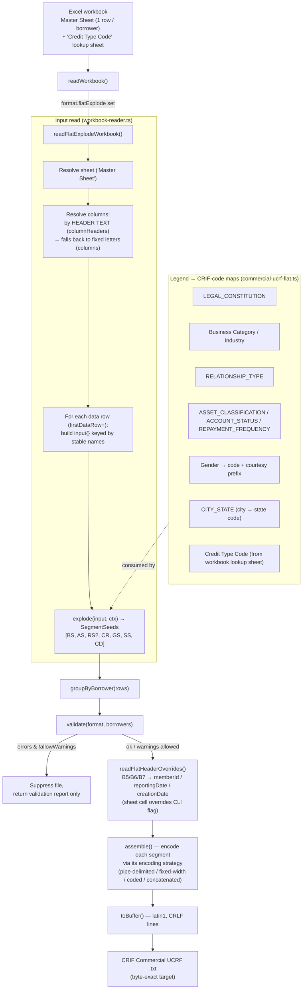
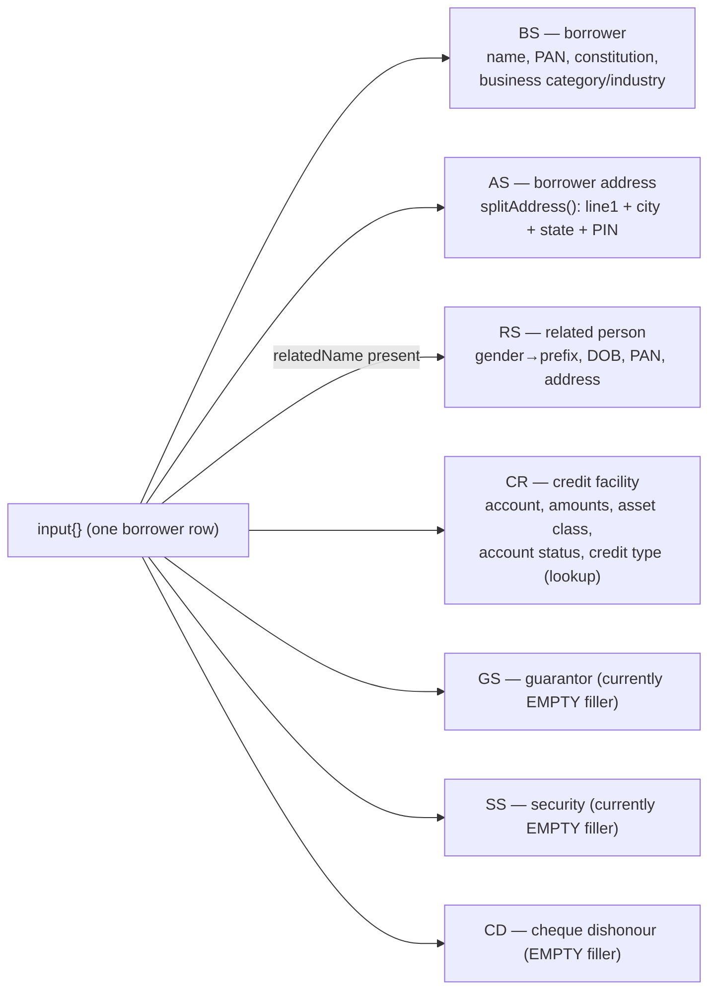
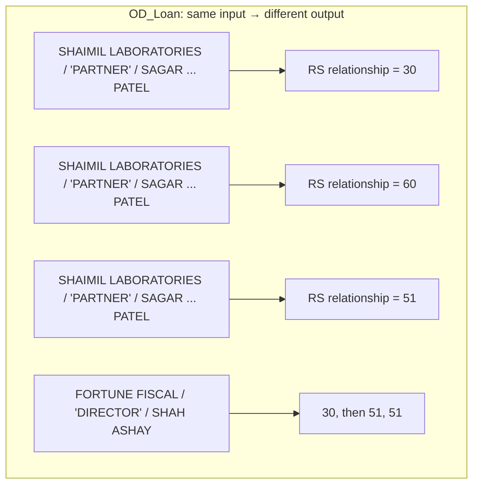

# Commercial "Master Sheet" → CRIF UCRF — Pipeline, Limitations & Data Variants

> Focused companion to `ARCHITECTURE_AND_BUSINESS.md`. Covers the **commercial
> flat-explode** path (`commercial-ucrf-flat`): the one accountants use when they
> keep **one flat row per borrower** in a "Master Sheet" and we explode it into the
> per-segment CRIF Commercial UCRF file (HD/BS/AS/RS/CR/GS/SS/CD/TS).
>
> Last updated 2026-08-11. Grounded in:
> - `packages/core/src/core/pipeline.ts`
> - `packages/core/src/input/workbook-reader.ts` (`readFlatExplodeWorkbook`)
> - `packages/core/src/formats/commercial-ucrf-flat.ts` (`commercial-ucrf-flat-v310` primary profile)
> - `packages/core/src/formats/commercial-ucrf.ts` (segment wire specs & V3.10 profile)
> - `.agents/skills/crif-commercial-v310-spec-and-delimiter-guidelines/SKILL.md` (Skill reference)
> - `.agents/skills/crif-commercial-address-dual-emission/SKILL.md` (AS dual-emission skill)

---

## 1. How it's implemented (end-to-end)

The engine is **spec-driven**: segment layouts, field order, codes and encodings
live as data in the format spec; the pipeline is generic. The commercial Master
Sheet reuses the canonical `commercial-ucrf` segment specs for **encoding**, and
only swaps the **input shape** via a `flatExplode` block.

### The `explode()` contract (the heart of it)

One flat row → an ordered list of segment "seeds" for a single borrower:

### Why "spec-driven" matters here

- **Header-text column resolution** (`columnHeaders`) makes one profile read
  layouts where columns shift position — it matches by normalized label prefix
  (longest match wins), not by column letter. Fixed letters (`columns`) are the
  fallback.
- **Legend tolerance**: each code map accepts the legend **number** ("4"), a
  **label** ("Proprietorship"), or an already-CRIF-coded value — because
  accountants use all three.
- **Header cells override CLI flags**: `B5/B6/B7` (Member ID / Reporting Date /
  Creation Date) in the sheet win over `--member-id` / `--reporting-date` etc.

---

## 2. The newer input files (1 Jul batch) — what was fixed

Investigated against `commercial_input_1Jul.xlsx` and
`commercial_input_1Jul_OD_Loan.xlsx` vs their expected `.txt`, then implemented from
the authoritative V3.9 catalogues (see the `crif-commercial-format` skill).

### 2a. Deterministic gaps — **now fixed**

| # | Gap | Correct behaviour | Fix |
|---|-----|-------------------|-----|
| 1 | **Legal-constitution codes** | Proprietorship=`30`, Partnership=`40`, HUF=`55` (8.2) | `LEGAL_CONSTITUTION` rebuilt from catalogue 8.2 |
| 2 | **Business Category / Industry** | text-only labels (`OTHERS`→`07` cat / `11` ind) by legend position | `BUSINESS_CATEGORY` / `BUSINESS_INDUSTRY` maps |
| 3 | **Asset classification** | `SMA 2`→`0008`, `Loss`→`0004` (8.10, non-sequential) | `ASSET_CLASSIFICATION` rebuilt from catalogue 8.10 |
| 4 | **State codes** | Gujarat=`11`, Maharashtra=`20`, UP=`33` (8.6) | `STATE_CODE` enum replaced with catalogue 8.6 |
| 5 | **Address (AS/RS/GS)** | full address in Line 1 + City/District(=state)/code/PIN extracted (state-in-text); older `<street>,<City>-<PIN>` form keeps street-only Line 1 + city→state lookup | `splitAddress` handles both conventions |
| 6 | **GS (guarantor)** | one GS per populated block; positional detection for 3-block and 1-block layouts | `readGuarantorBlocks` via `ctx.rawCells`; **GS wire spec order corrected** (namePrefix@6, address@23) |
| 7 | **SS (security)** | `SS\|value\|INR\|010\|01` (type 3-digit 8.14; class incl. collateral 21–24 8.15) | SS populated + `SECURITY_CLASS` map |
| 8 | **Empty fillers** | GS/SS/CD emitted **only when populated** (matches both clients' real goldens) | dropped the always-empty filler rows |

The full test suite stays green and both 1 Jul files convert with **zero validation errors**.

### 2a-bis. Residual divergences on the 1 Jul golden — irreducible hand artifacts

The 1 Jul `.txt` is itself partly hand-finalized, so ~34 of 92 lines still differ —
none are converter bugs:
- **RS name-prefix casing** (`MR`/`MRS` vs canonical `Mr`/`Ms`) — a per-client cosmetic
  choice that *contradicts* the earlier client golden (`Mr`), so it can't be made
  deterministic for both.
- **GS address fields** — the golden parses guarantor addresses inconsistently (stray
  leading spaces; picks a different city segment than the AS/RS of the same address).
- A **trailing space** in one borrower name and a **misspelled city** typed differently
  from the address text.

### 2b. Structural limitation — column-layout drift between templates

The two 1 Jul files have **different columns for the same concept**:

- `commercial_input_1Jul`: a **doubled** "Asset Classification" column (blank label
  + legend column) → related-person block starts at **col X**; **three** guarantor
  blocks (each: Type, Cat, Ind, Entity, Name, DOB, PAN, Aadhaar, Gender, Address).
- `commercial_input_1Jul_OD_Loan`: a **single** Asset-Classification column →
  everything shifts one left; related block at **col W**; **one** guarantor block
  with a **Contact** column and **no** DOB/PAN/Aadhaar.

Header-text matching absorbs *single-column* shifts, but **repeated identical
"Guarantor Type" headers** can't be disambiguated by label alone — the reader needs
positional block detection for the guarantor/security region.

### 2c. Hard blocker — the OD_Loan golden is **not deterministically reproducible**

Identical input rows map to **different** output codes, so no pure function of the
sheet can reproduce it. It appears **hand-finalized**:

Also OD uses a **different address convention** (District carries the **city**, not
the state; addresses split on line-breaks into Line1/Line2), inconsistent with the
standard file. Even the standard file has a manual artifact — GS district reads
`" Uttar Pradesh"` (leading space) while the matching RS is clean.

**Decision (2026-07-01):** treat OD_Loan as **smoke-only** (must convert without
validation errors), not a byte-exact golden. Unseen codes are **derived from
samples**; values we can't observe are left unmapped/flagged rather than guessed.

---

## 3. Historical data variants seen

What the reference corpus (`training-references/crif-reporting-io/`) tells us about
the shapes real accountants send. This is why the engine leans on header-text
matching + tolerant legend maps rather than fixed positions.

### Input-shape families

| Family | Examples | Shape | Reader path |
|--------|----------|-------|-------------|
| **Commercial Master Sheet** (flat-explode) | `client-commercial-data-input-1`, `client-input-commercial-2`, `Captree_commercial_input`, `commercial_input_1Jul(_OD_Loan)` | 1 row / borrower; borrower + related + up to 3 guarantors + security + cheque side-by-side; top cells carry Member ID / dates; a "Credit Type Code" lookup tab | `readFlatExplodeWorkbook` |
| **Commercial per-segment working file** | `client-commercial-working-data-accounting-1` | one tab per segment (HD/BS/AS/RS/CR/GS/SS/CD/TS) — the accountant "working file" mirror | segment reader |
| **Consumer Data Submission Form** (flat single-record) | `client-input-consumer-input-1`, `consumer-input-2`, `consumer_input_failing` | 1 row / consumer; label row → fields | `readFlatWorkbook` |

### Within-family variations we've had to tolerate

| Dimension | Variants observed |
|-----------|-------------------|
| **Column position** | Doubled vs single "Asset Classification" column shifts the related/guarantor/security blocks; related block seen at col **X** and col **W** |
| **Guarantor block** | **3 blocks** (with DOB/PAN/Aadhaar) *vs* **1 block** (with a Contact column, no DOB/PAN/Aadhaar) |
| **Legend encoding** | Numbered (`"4. Proprietorship"`) *vs* bare label (`"PARTNERSHIP"`, `"OTHERS"`, ALL-CAPS) *vs* already-coded |
| **Placeholders** | `NA` used liberally for empty fields (must be treated as blank) |
| **Dates** | DDMMYYYY text, Excel serial numbers, and JS `Date` objects (e.g. `Sat Jul 31 1976 …`) all appear |
| **Address** | Single free-text blob with embedded PIN; commas optional; state sometimes present in text, sometimes not; line-breaks used as address-line separators |
| **Amounts** | Plain integers, comma-grouped, occasional scientific-notation noise |
| **Header cells** | Member ID + Reporting Date present; **Creation Date often absent** from the sheet (must come from CLI/UI) |
| **Code tables (client-specific)** | State numbering is **not** the CRIF spec table (client uses UP=33, Gujarat=11, Maharashtra=20); constitution/relationship codes are CRIF's real non-sequential codes |
| **Determinism** | Some "golden" outputs are **hand-finalized** — same input, different output — so they're smoke-only references, not byte goldens |

---

## 4. Takeaways for the engine

1. **Never trust column position** — resolve by header text; add positional block
   detection only for repeated headers (guarantors).
2. **Codes are client-specific and non-sequential** — keep them in explicit,
   sample-anchored maps; **flag** unseen values instead of guessing.
3. **Distinguish byte-goldens from smoke references** — hand-finalized files can't
   be byte-matched; the validate-references gate must classify each pair.
4. **Address parsing is the fragile core** — retain Line 1 verbatim, extract
   City/State/PIN cleanly into dedicated fields.

---

## 5. V3.10 Profile & Delimiter Guidelines

1. **V3.10 Primary Format**: `commercial-ucrf-flat-v310` is the default, primary format for commercial exports.
2. **V3.9 Deprecation**: `commercial-ucrf-flat` is marked as `Commercial UCRF V3.9 (Deprecated)` and retained for legacy reference validation.
3. **CR Delimiter Rules**: The standard wire format expects **44 fields (43 pipe delimiters)** for `CR`, ending at `ufceAmount` (Field 44).
4. **Detailed Reference**: See `.agents/skills/crif-commercial-v310-spec-and-delimiter-guidelines/SKILL.md`.
